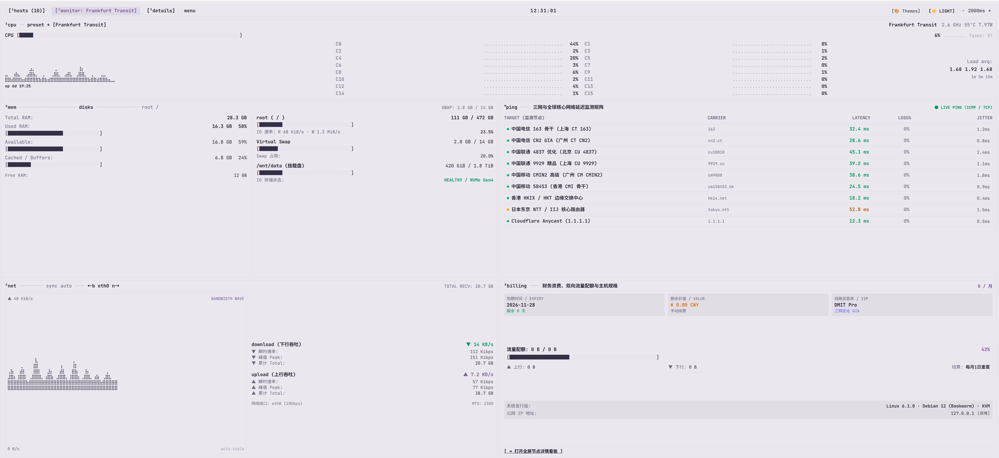
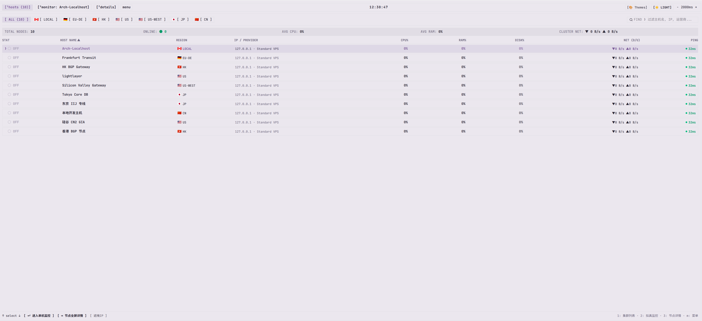

# 📟 btop++ 极客终端主题 (Komari & Cyber Probe)

<p align="center">
  
  
  
  
</p>

真实还原 Linux 顶级终端监控工具 **btop++** 硬核字符与霓虹点阵风格的监控看板主题，面向 **Komari** 与 **Cyber Probe** 探针系统开发。全等宽字符排版、四象限终端模块布局、高刷新率动态盲文图谱，为您带来沉浸式 TUI 极客运维体验。

---

## 📸 界面预览 (Screenshots)

### 1. 单机拟真终端监控视图 (Single Host Dedicated Monitor)


### 2. 多节点集群看板视图 (Fleet Hosts List Overview)


---

## ✨ 核心亮点 (Key Features)

- **纯正 btop++ TUI 终端美学**：采用纯直角硬朗形态、全等宽字体与字符边框，原汁原味还原原生 Linux 终端监控交互。
- **高保真动态图谱**：
  - Canvas 绘制盲文点阵 CPU 与网络波形，使用真实采样数据；
  - 分段量表随容器宽度铺满，括号贴边；占用达到 65% / 85% 时分别切换警告色 / 告警色。
- **三重视图自由穿梭**：
  - `[1] hosts`：集群多节点汇总与实时列表，支持根据地区、状态过滤、实时排序及关键字检索；
  - `[2] monitor`：单机终端监控，包含 CPU 负载、内存与 Swap 占用、根分区使用率、实时上下行网速、Ping 探测和资费信息；
  - `[3] details`：全屏诊断象限，展示系统环境、资源负载、网络速率、计费与探测目标。
- **双色终端外观**：
  - 🌙 **暗色终端（btop++ Dark）**：经典深黑底色配霓虹青绿与暗紫量表；
  - ☀️ **截图浅色（btop++ Light）**：原汁原味还原 btop++ 官方淡灰紫复古终端高亮外观，适合明亮环境与汇报截图。
- **双通道协议自适应**：
  - 接入 **Cyber Probe** 时，自动启用秒级原生高频 WebSocket 数据流；
  - 接入 **Komari 监控** 时，自动无缝适配 `/api/nodes` 与 `/api/clients` 协议。
- **真实指标与缺省状态**：不填入虚构的主频、温度、功耗、挂载盘或网卡速率；网络指标说明为物理网卡汇总。无法获得的部分字段显示 `--`，未设置流量配额时显示「无限制」。
- **路由兼容**：静态资源使用站点根路径，在 `/` 和 `/dashboard` 页面下都能正常加载。
- **隐私脱敏支持**：提供一键【遮掩 IP / 显示 IP】切换。

---

## 🚀 安装与使用 (Installation)

### 方式一：Komari / Probe 管理后台上传（推荐）
1. [下载仓库中的最新插件包 `btop-terminal.zip`](https://raw.githubusercontent.com/wildalley/komari-theme-btop/main/btop-terminal.zip)；
2. 登录您的 Komari 或 Cyber Probe 管理后台（`/admin`）；
3. 进入「主题中心」 $\rightarrow$ 点击「上传本地主题包」 $\rightarrow$ 选择 `btop-terminal.zip`；
4. 点击「设为生效」即可完成安装与切换。

### 方式二：服务器手动解压安装
直接在服务器端将本仓库克隆或解压至主题目录：

```bash
# 在 Probe 服务端工作目录执行；若设置了 PROBE_THEMES_DIR，请替换 themes
mkdir -p themes/btop-terminal
wget -O themes/btop-terminal.zip https://raw.githubusercontent.com/wildalley/komari-theme-btop/main/btop-terminal.zip
unzip -o themes/btop-terminal.zip -d themes/btop-terminal

# 重启服务端后，在后台主题中心启用
```

---

## 🔧 从源码打包

```bash
npm ci
npm run build
python3 -m zipfile -c btop-terminal.zip komari-theme.json preview.png preview-hosts.png LICENSE README.md dist
```

ZIP 根目录必须包含 `komari-theme.json` 和 `dist/index.html`。请从仓库根目录执行打包命令，避免在压缩包里多出一层父目录。

---

## ⚙️ 主题设置项 (Configuration)

主题支持在 Komari / Cyber Probe 后台主题设置中进行自定义：

| 配置键名 | 类型 | 默认值 | 说明 |
| :--- | :--- | :--- | :--- |
| `defaultColorMode` | `select` | `dark` | 默认色彩模式：`dark`（经典深色终端）或 `light`（复古浅色终端） |
| `refreshInterval` | `number` | `2` | 数据刷新周期（秒），建议设置为 1 ~ 3 秒 |

---

## 📄 开源许可证 (License)

本项目基于 [MIT License](LICENSE) 开源。欢迎 Star、Fork 与提交 Pull Request！
